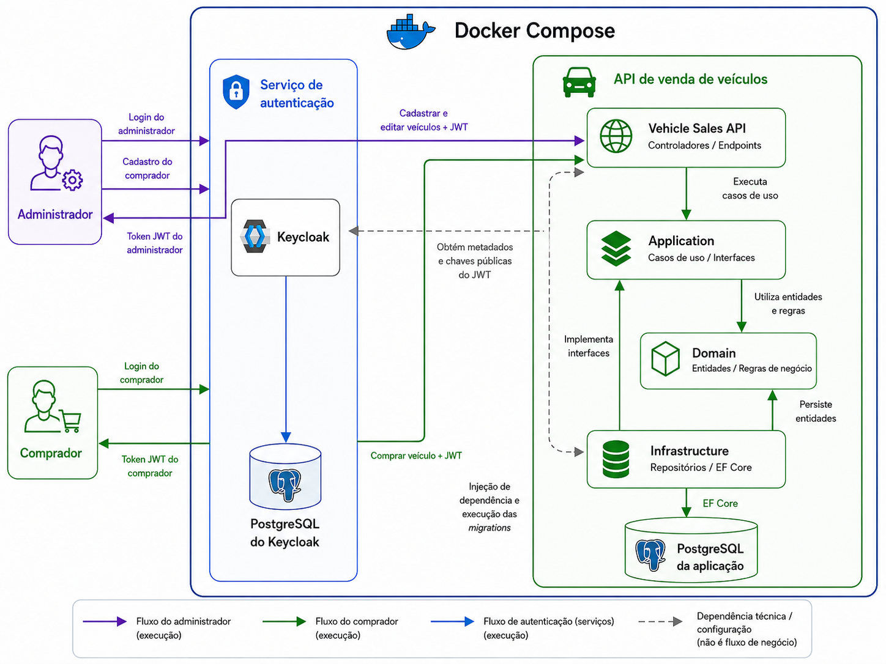

# FIAP Vehicle Sales Service

Microsserviço transacional de venda de veículos desenvolvido para o Tech Challenge da Pós Tech FIAP — Fase 4 — curso SOAT.

Este repositório contém somente as responsabilidades do serviço de vendas: sincronização interna do catálogo, listagens, reserva, compra e processamento interno do resultado do pagamento. Cadastro, edição e webhook público pertencem ao software principal, mantido em outro repositório e integrado por HTTP.

A autenticação e autorização dos compradores foi implementada de forma separada da API principal, utilizando Keycloak, conforme a proposta do desafio de manter os dados dos clientes separados dos dados transacionais de vendas.

---

## Índice

* [Sobre o projeto](#sobre-o-projeto)
* [Funcionalidades](#funcionalidades)
* [Tecnologias utilizadas](#tecnologias-utilizadas)
* [Arquitetura](#arquitetura)
* [Estrutura da solução](#estrutura-da-solução)
* [Como rodar localmente](#como-rodar-localmente)
* [Configuração do Keycloak](#configuração-do-keycloak)
* [Como gerar token JWT](#como-gerar-token-jwt)
* [Endpoints principais](#endpoints-principais)
* [Fluxo de compra](#fluxo-de-compra)
* [Modelagem do banco](#modelagem-do-banco)
* [Testes automatizados](#testes-automatizados)
* [CI/CD](#cicd)
* [Como testar no Swagger](#como-testar-no-swagger)

---

## Sobre o projeto

A empresa de revenda de veículos automotores precisa de uma plataforma web para vender veículos pela internet.

Como o time de frontend será responsável pela interface, este projeto entrega a API backend responsável pelas regras de negócio e persistência dos dados.

A API permite:

* Sincronizar internamente os veículos vindos do software principal;
* Listar veículos disponíveis;
* Listar veículos vendidos;
* Reservar e iniciar a compra de um veículo;
* Confirmar ou cancelar internamente o pagamento;
* Permitir compra apenas para usuários autenticados;
* Proteger endpoints internos por uma credencial de serviço.

---

## Funcionalidades

### Catálogo transacional

* Sincronização interna de veículo com:

  * Marca;
  * Modelo;
  * Ano;
  * Cor;
  * Preço.

* Listagem de veículos disponíveis para venda.

* Listagem de veículos vendidos.

* Ordenação das listagens por preço crescente.

### Compras

* Compra de veículo por usuário autenticado e CPF válido.
* Validação se o veículo existe.
* Validação se o veículo está disponível.
* Reserva do veículo enquanto o pagamento está pendente.
* Confirmação transforma o veículo em vendido.
* Cancelamento devolve o veículo para a listagem de disponíveis.
* Processamento idempotente das notificações de pagamento.

### Autenticação e autorização

* Autenticação separada usando Keycloak.
* Usuários e roles gerenciados fora da API principal.
* A API valida tokens JWT emitidos pelo Keycloak.
* Compradores usam a role `buyer`.
* O software principal usa client credentials e a role `vehicle-sales-service`.

---

## Tecnologias utilizadas

* .NET 10
* C#
* ASP.NET Core Web API
* Entity Framework Core
* PostgreSQL
* Docker
* Docker Compose
* Keycloak
* Swagger
* xUnit
* GitHub Actions
* Clean Architecture
* SOLID
* DDD simplificado

---

## Arquitetura

O projeto utiliza Clean Architecture com separação em camadas.

A ideia principal é proteger as regras de negócio e manter a aplicação organizada, simples e fácil de manter.



### Domain

Camada responsável pelas entidades e regras de negócio.

Contém:

* Entidades;
* Enums;
* Exceptions de domínio;
* Regras como:

  * veículo não pode ter preço inválido;
  * veículo vendido não pode ser editado;
  * veículo vendido não pode ser comprado novamente.

### Application

Camada responsável pelos casos de uso da aplicação.

Contém:

* DTOs;
* Interfaces de repositório;
* Casos de uso;
* Mappers;
* Exceptions da aplicação.

Exemplos de casos de uso:

* Criar veículo;
* Editar veículo;
* Listar veículos disponíveis;
* Listar veículos vendidos;
* Comprar veículo.

### Infrastructure

Camada responsável por detalhes externos.

Contém:

* DbContext;
* Configurações do Entity Framework;
* Repositórios;
* Migrations;
* Implementação das interfaces da camada Application.

### API

Camada responsável por expor os endpoints HTTP.

Contém:

* Controllers;
* Configuração do Swagger;
* Configuração de autenticação JWT;
* Configuração de autorização;
* Injeção de dependência.

---

## Estrutura da solução

```text
Fiap.VehicleSales
│
├── src
│   ├── Fiap.VehicleSales.Api
│   ├── Fiap.VehicleSales.Application
│   ├── Fiap.VehicleSales.Domain
│   └── Fiap.VehicleSales.Infrastructure
│
├── tests
│   ├── Fiap.VehicleSales.UnitTests
│   └── Fiap.VehicleSales.IntegrationTests
│
├── config
│   └── keycloak
│       └── fiap-vehicle-sales-realm.json
│
├── docker-compose.yml
├── README.md
└── .github
    └── workflows
        └── ci.yml
```

---

## Como rodar localmente

### Pré-requisitos

Antes de executar o projeto, é necessário ter instalado:

* .NET 10 SDK, caso queira executar os testes fora do Docker;
* Docker;
* Docker Compose;
* Git.

---

### Clonar o repositório

```bash
git clone https://github.com/AdamMachado/fiap-vehicle-sales.git
cd fiap-vehicle-sales
```

---

### Subir os containers

Execute:

```bash
docker compose up -d --build
```

Esse comando irá subir:

* API de venda de veículos;
* Banco PostgreSQL da API;
* Banco PostgreSQL do Keycloak;
* Keycloak.

---

### Aplicar migrations

As migrations do Entity Framework são aplicadas automaticamente durante a
inicialização da API. Em uma instalação nova, o banco e as tabelas são criados
sem a necessidade de executar `dotnet ef database update`.

Após iniciar a aplicação, acesse o Swagger:

```text
http://localhost:5000/swagger
```

### Reiniciar o ambiente do zero

Para remover os containers e apagar os volumes dos dois bancos:

```bash
docker compose down --volumes --remove-orphans
docker compose up -d --build
```

> Atenção: essa operação apaga definitivamente veículos, vendas, usuários e
> configurações persistidas no ambiente Docker local.

---

## Configuração do Keycloak

O realm `fiap-vehicle-sales`, o client `vehicle-sales-api`, as roles e os
usuários de demonstração são importados automaticamente na primeira
inicialização do Keycloak pelo Docker Compose.

Acesse o Keycloak:

```text
http://localhost:8080
```

Credenciais administrativas:

```text
Usuário: admin
Senha: admin
```

### Usuários de demonstração

Comprador:

```text
Username: buyer@test.com
Password: 123456
Role: buyer
```

Essas credenciais são destinadas exclusivamente ao ambiente local de
demonstração e devem ser substituídas em qualquer ambiente publicado.

---

## Como gerar token JWT

### Token do comprador

PowerShell:

```powershell
$buyerTokenResponse = Invoke-RestMethod `
  -Method Post `
  -Uri "http://localhost:8080/realms/fiap-vehicle-sales/protocol/openid-connect/token" `
  -ContentType "application/x-www-form-urlencoded" `
  -Body @{
    client_id = "vehicle-sales-api"
    username = "buyer@test.com"
    password = "123456"
    grant_type = "password"
  }

$buyerTokenResponse.access_token
```

---

### Token do software principal

PowerShell:

```powershell
$serviceTokenResponse = Invoke-RestMethod `
  -Method Post `
  -Uri "http://localhost:8080/realms/fiap-vehicle-sales/protocol/openid-connect/token" `
  -ContentType "application/x-www-form-urlencoded" `
  -Body @{
    client_id = "main-software"
    client_secret = "main-software-local-secret"
    grant_type = "client_credentials"
  }

$serviceTokenResponse.access_token
```

---

### Usar token no Swagger

No Swagger, clique em:

```text
Authorize
```

Informe o token no formato:

```text
seu_token_aqui
```

Informe somente o token. O Swagger adiciona o prefixo `Bearer`
automaticamente.

---

## Endpoints principais

### Sincronização interna do catálogo

```http
PUT /api/internal/vehicles/{id}
```

Permissão: role `vehicle-sales-service`, obtida pelo software principal via client credentials.

O mesmo endpoint cria ou atualiza o veículo de forma idempotente. Veículos reservados ou vendidos não podem ser alterados.

```json
{
  "brand": "Toyota",
  "model": "Corolla",
  "year": 2022,
  "color": "Prata",
  "price": 120000
}
```

### Veículos

#### Buscar veículo por ID

```http
GET /api/vehicles/{id}
```

Permissão:

```text
Público
```

---

#### Listar veículos disponíveis

```http
GET /api/vehicles/available
```

Permissão:

```text
Público
```

A listagem retorna veículos disponíveis ordenados por preço crescente.

---

#### Listar veículos vendidos

```http
GET /api/vehicles/sold
```

Permissão:

```text
Público
```

A listagem retorna veículos vendidos ordenados por preço crescente.

---

### Vendas

#### Comprar veículo

```http
POST /api/sales
```

Permissão:

```text
buyer
```

Body:

```json
{
  "vehicleId": "id-do-veiculo",
  "buyerCpf": "52998224725"
}
```

A API identifica o comprador pelo token JWT, reserva o veículo e retorna uma venda `Pending` com `paymentCode`.

#### Processar resultado do pagamento

```http
PUT /api/sales/payments/{paymentCode}
```

Permissão: role interna `vehicle-sales-service`.

```json
{
  "status": "Completed"
}
```

Também aceita `Canceled`. O processamento é idempotente.

---

## Fluxo de compra

O fluxo de compra funciona da seguinte forma:

```text
1. O comprador é cadastrado no Keycloak.
2. O comprador faz login e obtém um token JWT.
3. O comprador envia o token para a API.
4. A API valida o token.
5. A API extrai o identificador do comprador pelo claim sub.
6. O comprador informa o veículo e seu CPF.
7. A API verifica se o veículo existe.
8. A API verifica se o veículo está disponível.
9. A API cria uma venda Pending e gera o código de pagamento.
10. A API salva BuyerId e BuyerCpf na tabela Sales.
11. A API altera o veículo para Reserved.
12. O software principal recebe o webhook do processador.
13. O software principal chama o endpoint interno de pagamento.
14. Pagamento confirmado altera venda para Completed e veículo para Sold.
15. Pagamento cancelado altera venda para Canceled e veículo para Available.
```

---

## Estratégia de autenticação

A autenticação foi implementada de forma separada utilizando Keycloak.

O Keycloak possui banco próprio e é responsável por:

* Cadastro dos usuários;
* Login;
* Senhas;
* Roles;
* Emissão de tokens JWT.

A API principal não armazena dados sensíveis do comprador, como nome, e-mail ou senha.

Na tabela de vendas, a API salva o identificador do token e o CPF informado na compra.

Exemplo:

```text
BuyerId = claim sub do token
```

Essa separação mantém os dados de autenticação fora da base transacional da aplicação.

---

## Regras de autorização

| Endpoint                    | Permissão |
| --------------------------- | --------- |
| PUT /api/internal/vehicles/{id} | vehicle-sales-service |
| GET /api/vehicles/{id}      | público   |
| GET /api/vehicles/available | público   |
| GET /api/vehicles/sold      | público   |
| POST /api/sales             | buyer     |
| PUT /api/sales/payments/{paymentCode} | vehicle-sales-service |

---

## Modelagem do banco

### Vehicles

Tabela responsável por armazenar os veículos.

| Campo     | Tipo      | Descrição                |
| --------- | --------- | ------------------------ |
| Id        | uuid      | Identificador do veículo |
| Brand     | varchar   | Marca do veículo         |
| Model     | varchar   | Modelo do veículo        |
| Year      | int       | Ano do veículo           |
| Color     | varchar   | Cor do veículo           |
| Price     | decimal   | Preço do veículo         |
| Status    | int       | Status do veículo        |
| CreatedAt | timestamp | Data de criação          |
| UpdatedAt | timestamp | Data de atualização      |

Status possíveis:

```text
1 = Available
2 = Reserved
3 = Sold
```

---

### Sales

Tabela responsável por armazenar as vendas realizadas.

| Campo     | Tipo      | Descrição                                 |
| --------- | --------- | ----------------------------------------- |
| Id        | uuid      | Identificador da venda                    |
| VehicleId | uuid      | Identificador do veículo vendido          |
| BuyerId   | varchar   | Identificador do comprador vindo do token |
| BuyerCpf  | varchar   | CPF normalizado do comprador              |
| PaymentCode | varchar | Código único do pagamento                  |
| Price     | decimal   | Preço no momento da venda                 |
| SaleDate  | timestamp | Data da venda                             |
| PaymentProcessedAt | timestamp | Data da confirmação ou cancelamento |
| Status    | int       | Status da venda                           |

Status possíveis:

```text
1 = Pending
2 = Completed
3 = Canceled
```

---

## Testes automatizados

O projeto possui testes automatizados com xUnit.

Para executar:

```bash
dotnet test
```

Atualmente, a suíte possui testes unitários e de integração,
cobrindo:

* Deve sincronizar o catálogo somente pela API interna;
* Não deve criar veículo com preço inválido;
* Não deve editar veículo vendido;
* Deve comprar veículo disponível;
* Deve reservar o veículo até o resultado do pagamento;
* Deve confirmar ou cancelar o pagamento de forma idempotente;
* Não deve comprar veículo já vendido;
* Deve listar veículos disponíveis ordenados por preço;
* Deve listar veículos vendidos ordenados por preço.

---

## CI/CD

O projeto utiliza GitHub Actions para validação automática.

O pipeline executa:

```text
Restore
Build
Test
Upload dos resultados de teste
Docker build
Validação do ambiente completo com Docker Compose
Validação da autenticação no Keycloak
Publicação da imagem no GitHub Container Registry
```

O workflow é executado em Pull Requests e pushes para a branch `master`.
Também pode ser iniciado manualmente pelo GitHub Actions. Em Pull Requests e
execuções manuais, todo o ambiente é construído e validado, mas a imagem não é
publicada. Em pushes para `master`, depois de todas as validações, a imagem é
publicada no GHCR com as tags do commit e `latest`:

```text
ghcr.io/adammachado/fiap-vehicle-sales-api:<commit-sha>
ghcr.io/adammachado/fiap-vehicle-sales-api:latest
```

O pipeline utiliza o `GITHUB_TOKEN` fornecido pelo GitHub Actions e a
permissão `packages: write`. O deploy da imagem em um ambiente público ainda
não faz parte deste workflow.

---

## Como testar no Swagger

### 1. Subir infraestrutura

```bash
docker compose up -d --build
```

---

### 2. Acessar Swagger

```text
http://localhost:5000/swagger
```

### 3. Gerar token do software principal

Use o fluxo `client_credentials` do client `main-software`.

---

### 4. Autorizar no Swagger

Clique em:

```text
Authorize
```

Informe o token do serviço.

---

### 5. Sincronizar veículo

```http
PUT /api/internal/vehicles/{id}
```

---

### 6. Gerar token de comprador

Use o token do usuário:

```text
buyer@test.com
```

---

### 7. Comprar veículo

```http
POST /api/sales
```

---

### 8. Processar o pagamento

Autorize novamente com o token do serviço e envie `Completed` ou `Canceled`:

```http
PUT /api/sales/payments/{paymentCode}
```

---

### 9. Listar veículos disponíveis

```http
GET /api/vehicles/available
```

O veículo comprado não deve aparecer mais.

---

### 10. Listar veículos vendidos

```http
GET /api/vehicles/sold
```

O veículo comprado deve aparecer como vendido.

---

## Demonstração esperada no vídeo

O vídeo de demonstração deve apresentar:

```text
1. Infraestrutura subindo com Docker Compose.
2. Keycloak funcionando.
3. Cadastro ou exibição do usuário comprador.
4. Geração do token JWT.
5. Sincronização do veículo pelo software principal.
6. Listagem de veículos disponíveis.
7. Compra do veículo autenticado como comprador.
8. Listagem de veículos vendidos.
9. Execução dos testes.
10. Pipeline de CI/CD no GitHub Actions.
```

---

## Decisões técnicas

### Por que Clean Architecture?

Foi utilizada para separar responsabilidades e evitar acoplamento entre regras de negócio, banco de dados e API.

### Por que Keycloak?

Foi utilizado para manter autenticação e autorização separadas da solução principal.

### Por que PostgreSQL?

Foi escolhido por ter boa integração com Docker, Entity Framework Core e Keycloak.

### Por que usar uma role de serviço?

Catálogo e resultado do pagamento são responsabilidades integradas ao software principal. A role `vehicle-sales-service` impede que usuários administrativos ou compradores chamem esses contratos internos.

---

## Autor

Projeto desenvolvido para o Tech Challenge — Pós Tech FIAP — Fase 4 — SOAT.
